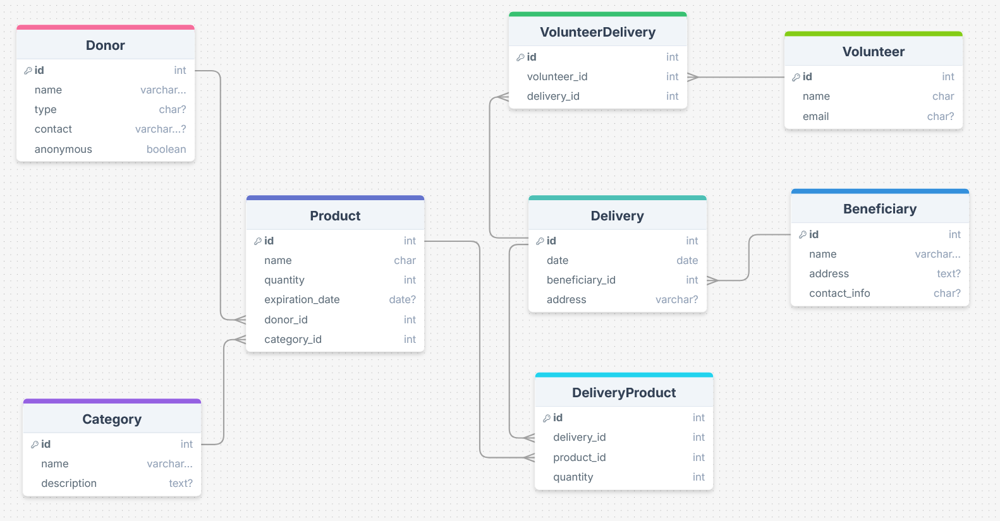

# Food Pantry

Food Pantry es un sistema de gestión para bancos de alimentos desarrollado con Django.  
Permite administrar beneficiarios, donaciones, entregas y el inventario de productos alimentarios.

---

## Tecnologías utilizadas

- Python 3.11+
- Django 4.x
- SQLite (modo desarrollo)
- HTML/CSS (interfaz básica del admin de Django)
- Git y GitHub

---

## Instalación

1. Clonar el repositorio

```bash
git clone https://github.com/tu_usuario/food_pantry.git
cd food_pantry
```

2. Crear un entorno virtual y activarlo

```bash
python3 -m venv env
source env/bin/activate  # En Windows: env\Scripts\activate
```

3. Instalar las dependencias

```
pip install -r requirements.txt
```

4. Aplicar migraciones

```
python manage.py migrate
```

5. Ejecutar el servidor de desarollo

```
python manage.py runserver
```

---

## Estructura del proyecto

```
food_pantry/
├── food_pantry/               Configuración principal de Django
├── beneficiaries_api/         Lógica BENEFICIARIO
├── categories_api/            Lógica CATEGORIA
├── deliveries_api/            Lógica DELIVERY
├── delivery_products_api/     Lógica DELIVERYPRODUCT
├── donors_api/                Lógica DONANTE
├── volunteer_deliveries_api/  Lógica VOLUNTEERDELIVERY
├── volunteers_app/            Lógica VOLUNTEER
├── food_pantry_app/           Lógica del sistema
├── manage.py                  Archivo de control del proyecto
├── venv/                      Entorno virtual (no incluido en el repositorio)
├── requirements.txt           Lista de dependencias
├── common
|     ├── test/                Mocks para el unit testing
|     ├── logger-py            Lógica implementación de logs del sistema
|            
├── fixtures
|     ├── management
|           ├── commands       Scripts rebuild base de datos (clean, populate, rebuild)
|
├── logs                       Centralización de logs
├── README.md
├── docs/Database_Model_Documentation_v1.0.pdf  Data Base schema description
└── images/ER_Food_Pantry_DB_schema_v1.0.png    ER Diagram DB schema            
```

---

## Esquema de Base de Datos

El modelo de base de datos de la aplicación **Food Pantry** ha sido diseñado para cubrir funcionalidades clave como entregas a beneficiarios, control de inventario de productos, coordinación de voluntarios y seguimiento de donantes.

### Tablas o entidades

- `Beneficiary`
- `Volunteer`
- `VolunteerDelivery`
- `Product`
- `Delivery`
- `DeliveryProduct`
- `Donor`
- `Category`

### Resumen

- Los **beneficiarios** (Tabla **Beneficiary**) reciben entregas registradas en la tabla `Delivery`.
- Los **voluntarios** (Tabla **Volunteer**) se vinculan a las entregas mediante la tabla `VolunteerDelivery`.
- Los **productos** (Tabla **BProducts**) se categorizan y gestionan teniendo en cuenta su expiración y el control de stock.
- Cada entrega (Tabla **Delivery**) puede incluir múltiples productos, administrados a través de la tabla `DeliveryProduct`.
- Todas las relaciones utilizan **claves foráneas** para asegurar la integridad referencial.

### Diagrama Entidad-Relación (ER)

Puedes consultar el esquema visual de la base de datos en el siguiente diagrama:

  

### Documentación Detallada

Una descripción completa de las entidades, atributos, relaciones y restricciones está disponible en la siguiente documentación:

  [`docs/Food_Pantry_DB_Schema_Summary_v1.0_EN.pdf`](docs/Food_Pantry_DB_Schema_Summary_v1.0_EN.pdf)


 *Última actualización: Julio 2025 — Mantenido por el equipo de desarrollo de OCAWEB*

---

## Ejecución scripts reconstrucción base de datos

La aplicación incluye scripts de vaciado y carga de la base de datos, disponibles como comandos de Django:

### Limpieza o vaciado de base de datos (mantiene estructura)

Elimina todos los registros de la base de datos (útil para empezar desde cero):

```
python manage.py clean_db
```

### Carga de datos ficticios de prueba con Faker

Genera registros de prueba usando datos aleatorios realistas (útil para desarrollo y testeo):

```
python manage.py faker_populate_db
```

### Reconstruir base de datos

Ejecuta primero clean_db y luego faker_populate_db automáticamente:

```
python manage.py rebuild_db
```
Todos los scripts generan logs detallados en la carpeta logs/, por ejemplo:

 - logs/clean_db.log
 - logs/populate_db.log
 - logs/scripts.log (si se usa el logger por nombre genérico)
 - logs/tests.log (cuando se ejecutan los tests)

---

## Pruebas con pytest

Para ejecutar todos los tests de la aplicación y ver el resumen detallado, se han definido pruebas automatizadas con pytest y pytest-django.:

```
pytest -v
```

Esto ejecutará los tests definidos en la carpeta food_pantry/common/test/ para cada módulo (donors_api, beneficiaries_api, etc.) y generará registros en el fichero logs/tests.log.

Asegúrate de que las variables de entorno y el entorno virtual estén correctamente activados (venv) antes de lanzar las pruebas.

---

## Equipo de desarollo

  - Óscar Rodríguez - Coordinador general
  - Ciprian Nica - Back
  - Aroa Mateo - Front
  - Alfonso Bermúdez - BD y Documentación

## Estado del proyecto
Este sistema se encuentra actualmente en desarrollo como parte de una entrega académica

## Licencia
Todos los derechos reservados. Proyecto realizado con fines educativos.
